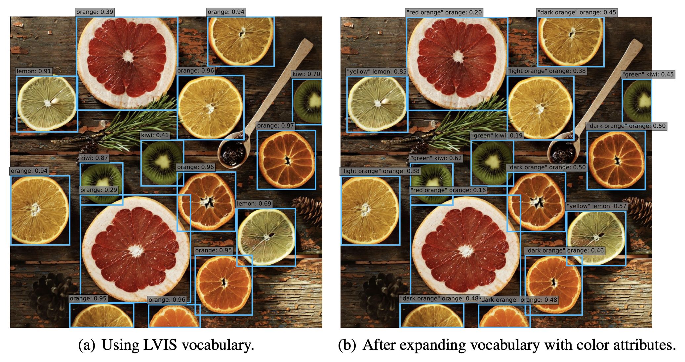

# Getting Started with Open Vocabulary Detection

A simple demo that will allow you to run the Object Detector with open vocabulary on your data
and store the bounding box embeddings for later classification with CLIP-like models without running the detector again.
<hr />

# Overview
Open-vocabulary detection (OVD) aims to generalize beyond the limited number of base classes
labeled during the training phase. The goal is to detect novel classes defined by an unbounded
(open) vocabulary at inference. Owing to the challenging nature of the OVD task, different forms of
weak-supervision for novel categories are typically used, e.g., extra image-caption pairs to enlarge
the vocabulary, image-level labels on classification datasets and pretrained open-vocabulary
classification models like [CLIP](https://github.com/openai/CLIP). 

Above we show an example of detection results by [VILD](https://github.com/tensorflow/tpu/tree/master/models/official/detection/projects/vild) model which distills the knowledge from a pretrained open-vocabulary image
classification model into a two-stage detector. Authors add 11 color attributes (red orange,
dark orange, light orange, yellow, green, cyan, blue, purple, black, brown, white) to LVIS categories without re-training. As we can see from the results their open-vocabulary
detector is able to assign the correct color to each fruit. 

<hr />

### Main Contributions
1) We used official implementation of [Object Centric Open Vocabulary Detection](https://github.com/hanoonaR/object-centric-ovd) along with [Detectron2](https://github.com/facebookresearch/detectron2) library for inference.
2) We modified the sources to obtain embeddings from the predicted bounding boxes, which can be classified with an updated vocabulary, but without re-running the detector.

<hr />


## Installation
The code is tested with PyTorch 1.10.0 and CUDA 11.3. After cloning the repository, follow the below steps in [INSTALL.md](docs/INSTALL.md).

<hr />


## Usage
The minimal code for running the detector and retrieving the predictions is below:

```python
import cv2
from src import load_config, load_model

config = load_config("configs/LVIS_OVD_RKD_PIS_WeightTransfer_8x.yaml")
object_detector = load_model(config)
image = cv2.imread("demo/images/image_1.jpg")

predictions = object_detector([image])[0]["instances"].get_fields()
# where
pred_boxes = predictions['pred_boxes'].tensor.numpy()  # coordinates
scores = predictions['scores'].numpy()                 # confidence for each b-box
pred_classes = predictions['pred_classes'].numpy()     # indexes of predicted classes
pred_masks = predictions['pred_masks'].numpy()         # binary masks
box_features = predictions['box_features'].numpy()     # b-box CLIP-like embeddings
```

### Inference Demo with Pre-trained Models

We provide jupyter-notebook [OVD_Demo](demo/OVD_Demo.ipynb) and a command line tool to run a simple demo with pre-trained models:
```
python demo/run_demo.py --config configs/LVIS_OVD_RKD_PIS_WeightTransfer_8x.yaml --input demo/images/*.jpg --output demo/predictions --batch 2 --confidence-threshold 0.5
```
also you may specify config options via `--opts` like

* `MODEL.MASK_ON` (bool): flag to output object masks (default:False in order to speed up detection)
* `MODEL.ROI_HEADS.SCORE_THRESH_TEST` (float): alternative way to set confidence threshold
* `OUTPUT.BBOX_FEATURES` (bool): flag to additionally return clip-like box features

<hr />

## Models ZOO
Object-centric Open Vocabulary object detector  demonstrates state-of-the-art results on Open Vocabulary COCO and LVIS benchmark datasets.

All models taken from official repository and trained using 8 A100 GPUs. 

### Open-vocabulary COCO
Effect of individual components in our method. Note that weight transfer method provides complimentary gains from RKD and ILS, achieving superior results as compared to naively adding both components.

| Name                                                                                  | APnovel | APbase |  AP  | Train-time | Download                                                                                                                            |
|:--------------------------------------------------------------------------------------|:-------:|:------:|:----:|:----------:|---------------------------------------------------------------------------------------------------------------------------------------------------|
| [Base-OVD-RCNN-C4](configs/Base-OVD-RCNN-C4.yaml)                                     |   1.7   |  53.2  | 39.6 |     8h     |[model](https://github.com/hanoonaR/object-centric-ovd/releases/download/v1.0/coco_ovd_base.pth) |
| [COCO_OVD_Base_RKD](configs/COCO_OVD_Base_RKD.yaml)                                   |  21.2   |  54.7  | 45.9 |     8h     |[model](https://github.com/hanoonaR/object-centric-ovd/releases/download/v1.0/coco_ovd_rkd.pth) |
| [COCO_OVD_Base_PIS](configs/COCO_OVD_Base_PIS.yaml)                                   |  30.4   |  52.6  | 46.8 |    8.5h    |[model](https://github.com/hanoonaR/object-centric-ovd/releases/download/v1.0/coco_ovd_pis.pth) |
| [COCO_OVD_RKD_PIS](configs/COCO_OVD_RKD_PIS.yaml)                                     |  31.5   |  52.8  | 47.2 |    8.5h    |[model](https://github.com/hanoonaR/object-centric-ovd/releases/download/v1.0/coco_ovd_rkd_pis.pth) |
| [COCO_OVD_RKD_PIS_WeightTransfer](configs/COCO_OVD_RKD_PIS_WeightTransfer.yaml)       |  36.6   |  54.0  | 49.4 |    8.5h    |[model](https://github.com/hanoonaR/object-centric-ovd/releases/download/v1.0/coco_ovd_rkd_pis_weighttransfer.pth) |
| [COCO_OVD_RKD_PIS_WeightTransfer_8x](configs/COCO_OVD_RKD_PIS_WeightTransfer_8x.yaml) |  36.9   |  56.6  | 51.5 |  2.5 days  |[model](https://github.com/hanoonaR/object-centric-ovd/releases/download/v1.0/coco_ovd_rkd_pis_weighttransfer_8x.pth) |


### Open-vocabulary LVIS

| Name                                                                                 | APr  | APc  | APf  |  AP   | Train-time  | Download                                                                                                                  |
|--------------------------------------------------------------------------------------|:----:|:----:|:----:|:-----:|:-----------:|---------------------------------------------------------------------------------------------------------------------------|
| [mask_rcnn_R50FPN_CLIP_sigmoid](configs/mask_rcnn_R50FPN_CLIP_sigmoid.yaml)      | 12.2 | 19.4 | 26.4 | 20.9  |    4.5h     | [model](https://github.com/hanoonaR/object-centric-ovd/releases/download/v1.0/lvis_ovd_base.pth) |
| [LVIS_OVD_Base_RKD](configs/LVIS_OVD_Base_RKD.yaml)                              | 15.2 | 20.2 | 27.3 | 22.1  |    4.5h     | [model](https://github.com/hanoonaR/object-centric-ovd/releases/download/v1.0/lvis_ovd_rkd.pth) |
| [LVIS_OVD_Base_PIS](configs/LVIS_OVD_Base_PIS.yaml)                              | 17.0 | 21.2 | 26.1 | 22.4  |     5h      | [model](https://github.com/hanoonaR/object-centric-ovd/releases/download/v1.0/lvis_ovd_pis.pth) |
| [LVIS_OVD_RKD_PIS](configs/LVIS_OVD_RKD_PIS.yaml)                                | 17.3 | 20.9 | 25.5 | 22.1  |     5h      | [model](https://github.com/hanoonaR/object-centric-ovd/releases/download/v1.0/lvis_ovd_rkd_pis.pth) |
| [LVIS_OVD_RKD_PIS_WeightTransfer](configs/LVIS_OVD_RKD_PIS_WeightTransfer.yaml)   | 17.1 | 21.4 | 26.7 | 22.8  |     5h      | [model](https://github.com/hanoonaR/object-centric-ovd/releases/download/v1.0/lvis_ovd_rkd_pis_weighttransfer.pth) |
| [LVIS_OVD_RKD_PIS_WeightTransfer_8x](configs/LVIS_OVD_RKD_PIS_WeightTransfer_8x.yaml) | 21.1 | 25.0 | 29.1 | 25.9  |  1.5 days   | [model](https://github.com/hanoonaR/object-centric-ovd/releases/download/v1.0/lvis_ovd_rkd_pis_weighttransfer_8x.pth) |
